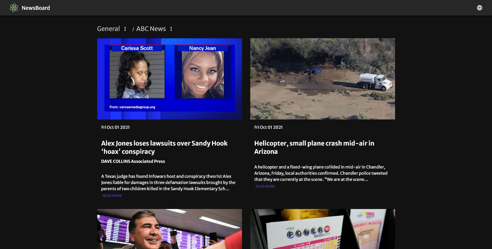

### NewsBoard

**This application was built to consolidate the major headlines from news outlets accross the world. The categories are defined and the users are free to select from a range of news sources for example BBC News. It also contains a country selection so that you can choose from the providers of a specific country and follow what is happening there.**

#### Tach Stack
*For this project I went with **ReactJS** with **Material-UI** used for the styled display.*

#### Current version and future plans
*The app works fine if you download and run it in local but unfortunately the 3rd party API being used to fetch the news headlines and sources doesn't allow for requests from anywhere other than localhost in its developer plan.*